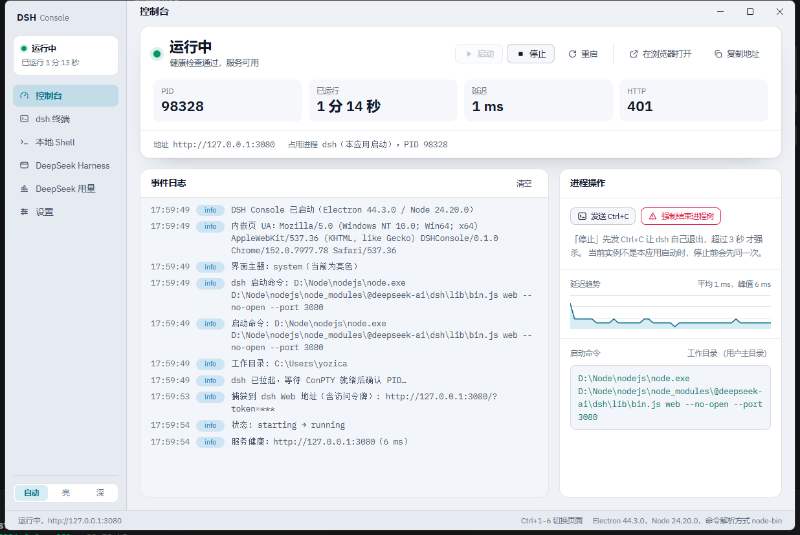

# DSH Console

桌面控制台（Windows / macOS），用来管本机的 DeepSeek Harness（`dsh web`）服务：
**启停它、盯着它、看它吐出来的东西** —— 不用再开一个终端敲 `npx dsh`，
也不用猜它到底起没起。



|                       |                                                                                          |
| --------------------- | ---------------------------------------------------------------------------------------- |
| **要什么**            | Windows 10/11 或 macOS 11+，加 Node.js ≥ 20（应用通过 PATH 找 `dsh`，见下）              |
| **怎么装（Windows）** | 下载 `DSH Console Setup x.y.z.exe` 直接装；也可用免安装的 `DSH Console x.y.z.exe`        |
| **怎么装（macOS）**   | 下载 `DSH Console-x.y.z-arm64.dmg`（Apple 芯片）或 `-x64.dmg`（Intel），拖进「应用程序」 |
| **怎么跑**            | 打开即用：应用会自动拉起 dsh、打开内嵌的 DeepSeek Harness 界面并进入应用内全屏           |

功能一览：

- **启停**：在真正的伪终端（Windows 走 ConPTY，macOS/Linux 走 forkpty）里拉起 `dsh web --no-open`，先 Ctrl+C 优雅退出，超时才强制结束整棵进程树
- **状态监听**：轮询 HTTP 健康检查 + 端口占用 + 进程存活，维护 `停止 / 启动中 / 运行中 / 异常 / 端口冲突` 状态机
- **终端**：xterm.js 直连 dsh 进程的 PTY，能看到 dsh 的全部输出（`dsh web` 不读键盘输入，所以输入是只读的，界面里也这么写）
- **接管已有实例**：启动前先探测端口，发现别的 dsh 在跑就不重复拉起，转为"接管显示"
- **内嵌 DSH 界面**：用 dsh 启动时打印的带 `token` 的地址（自动从终端输出里捕获）在窗口内打开，免开浏览器
- **本地 Shell**：窗口内另开一个 shell 排查问题（Windows 是 pwsh/cmd，macOS 是 zsh/bash），标签可重命名（不跨重启保留）
- **主题**：跟随系统 / 亮 / 深，终端配色跟着一起变

## 运行（开发）

Windows（PowerShell）：

```powershell
npm install
npm start          # = npm run build && electron .
```

macOS / Linux（zsh / bash）：

```bash
npm install
npm start
```

需要 Node ≥ 20（本机 v24 可用）。

**渲染层要经过 Vite 构建、主进程 / preload / 共享类型要经过 tsc 编译**：产物分别在
`dist/renderer/` 与 `dist/main/`、`dist/preload/`、`dist/shared/`，Electron 加载的是产物而不是源码。
相关命令：

| 命令                    | 作用                                                                                          |
| ----------------------- | --------------------------------------------------------------------------------------------- |
| `npm run build`         | 全量构建：渲染层（`vite build`）+ 主进程 / preload / 共享类型（`tsc -p tsconfig.main.json`）  |
| `npm start`             | 先构建再启动                                                                                  |
| `npm run watch`         | 只跑 `vite build --watch`：开发时开一个它，改源码会自动重建，应用里那个产物监听会随即重载窗口 |
| `npm run watch:main`    | 只跑 `tsc -p tsconfig.main.json --watch`：改主进程 / preload 时增量编译（要重启应用才生效）   |
| `npm run build:sandbox` | 受限环境（禁止子进程用管道）下用的包装脚本，见下                                              |

> `npm run build:sandbox`（`scripts/build.mts`）只做一件事：把 Vite 探测 Windows 网络驱动器用的
> `exec('net use')` 短路成"没有网络驱动器"。在不允许管道 stdio 的沙箱里，那次调用会直接
> `spawn EPERM` 让整个构建失败；普通开发机不需要它。
>
> 另外构建产物刻意做成**单个自包含的普通脚本**（构建插件把 `<script type="module">` 改回 `defer`）：
> ES module 在 `file://` 下会走 CORS 检查（origin 为 null）而加载失败。因此入口 `main.ts`
> **不要用动态 import** —— 那会切出第二个 chunk，跨 chunk 就必须用模块语法了。这条有自检兜着。

### 代码风格与提交前检查

格式、静态检查与类型检查的命令如下，配置都在仓库里：

| 命令                   | 作用                                                                                    |
| ---------------------- | --------------------------------------------------------------------------------------- |
| `npm run lint`         | ESLint 全量检查（含 Vue 单文件组件）                                                    |
| `npm run lint:fix`     | 同上，顺带修可自动修的问题                                                              |
| `npm run format`       | Prettier 全量格式化                                                                     |
| `npm run format:check` | 只检查不改写（CI 与 review 用）                                                         |
| `npm run typecheck`    | 类型检查全量：主进程（tsc）+ 渲染层（vue-tsc）+ 测试与脚本（tsc，`tsconfig.node.json`） |

格式的**唯一事实来源**是 `.prettierrc.json`。这个仓库的硬约定：**语句结尾要有分号**（`semi: true`）、
**多行数组 / 对象 / 参数的最后一项后面要有尾随逗号**（`trailingComma: "all"`）、**字符串用单引号**
（`singleQuote: true`）、**换行一律 LF**（`endOfLine: "lf"`，配合 `.gitattributes` 的
`* text=auto eol=lf`，Windows 与 macOS 双机开发不会互相改换行、也不会出现"整文件被改动"的假 diff）。

其中**有意改掉 Prettier 默认值**的只有两条：`printWidth: 100`（默认 80）与 `singleQuote: true`（默认双引号）。
其余键（`semi`、`trailingComma`、`tabWidth: 2`、`useTabs: false`、`bracketSpacing`、`arrowParens: "always"`、
`quoteProps`、`proseWrap`、`htmlWhitespaceSensitivity`、`vueIndentScriptAndStyle: false`、
`singleAttributePerLine: false`、`embeddedLanguageFormatting`）写出来**不是为了改行为**，而是把当前默认值
钉死，理由有两条：

- **这些是约定，不是"碰巧的默认值"**：`semi` / `trailingComma` 明写出来，就不会被哪次"顺手关掉"而没人发现
  （Prettier 3 之前尾随逗号的默认还是 `"es5"`，不同版本行为不一致）；
- **防整体重排**：`singleAttributePerLine` 与 `vueIndentScriptAndStyle` 一旦跟着 Prettier 的默认值变化，
  10 个单文件组件会被整体重排，diff 就没法 review 了。

那为什么在 `eslint.config.mjs` 里搜不到 `semi` / `comma-dangle` 这类规则？因为格式只由 Prettier 一家
负责：配置最后一行接的就是 `eslint-config-prettier`，它把所有与 Prettier 冲突的格式规则全部关掉。
两边都开的话，编辑器里两个 `--fix` 会互相打架。

规则取向见 `eslint.config.mjs`：

- 基础是 `js.configs.recommended` + `eslint-plugin-vue` 的 `flat/recommended`；
- 最后接 `eslint-config-prettier`（理由见上：格式一律交给 Prettier）；
- 按文件类型分别给全局：`src/main`、`src/preload`、`src/shared` 与 `test` 是 Node（源码写 ESM 语法，
  由 tsc 编译成 CJS），`tools`、`scripts` 与 Vite 配置是 Node ESM，`src/renderer` 是浏览器环境；
- 有意关掉两条并写了理由：`no-control-regex`（本项目的领域就是 ANSI 控制序列与内部占位符，
  都是显式字面量）、`vue/attributes-order`（模板里 `class` 写在最前是既定写法，Prettier 也不重排属性）。

`husky` 的 `pre-commit` 只跑 **`lint-staged`**：仅处理**这次改到的文件**（先 `eslint --fix` 再
`prettier --write`），不碰没动过的文件。全量检查是上面那几条命令与 CI 的事 —— CI 的两个打包 job 都会跑
`npm test` 与 `npm run lint && npm run format:check && npm run typecheck`，任一不过就不会发版。

> 临时要跳过钩子：`git commit --no-verify`。偶尔用可以，别形成习惯 —— 它跳过的只是"本地这次检查"，
> CI 那一关照样在。

### 模块求值顺序（踩过一次，白屏）

`src/renderer/main.ts` 里的 import 顺序有语义，别调换：

```js
import '@xterm/xterm/css/xterm.css'; // 1. xterm 自带样式在前
import './styles.css'; // 2. 我们的覆盖在后（同权重靠顺序决定谁生效）

import './app.js'; // 3. 应用级胶水先求值

import { installDevDiagnostics } from './dev-diagnostics.js';
import { snapshot, startStore } from './lib/store.js';
import { mountAll } from './mount.js';
```

（源码是 TS，但相对导入沿用源码里的 `./x.js` 写法；Vite 与 vue-tsc 都会把它解析到同名的 `.ts`。）

三条理由：

1. **xterm 自带 css 必须排在 `styles.css` 之前**：两者对 `.xterm-viewport` 的规则同权重，
   靠顺序决定谁生效 —— 反了会让 xterm 写死的黑底盖住我们的覆盖（症状：亮色主题下终端底部一块黑）。
2. **`app.ts` 要在建立共享状态与挂载之前求值**：它一被求值就接上启动锁、快捷键、自动打开这些
   应用级逻辑；接着 `startStore()` 建立**唯一**的快照订阅，最后才 `mountAll()` —— 组件一挂上就要读数据，
   订阅晚于挂载的话首个挂载会读到空快照（事件日志首个挂载是空的，这个坑踩过）。
3. **开发诊断用静态 import + 运行时判断**（`if (!snapshot.value?.env?.packaged) installDevDiagnostics()`），
   不能写成动态 import —— 那会切出第二个 chunk，产物就不能是单文件普通脚本了。

当时白屏的那一次是：`app.ts` 一被求值就可能**立刻**启动界面（它不再等 `DOMContentLoaded` —— 产物是
`<script defer>`，执行时 `document.readyState` 已经是 `interactive`，于是走了"立即启动"那条分支），
而启动要建终端，所以终端依赖的东西必须在那之前就位。教训现在仍然成立：**静态 import 会被提升**，
想在入口的模块体里做赋值去抢在 import 之前是不可能的 —— 那类初始化只能写成一个被 import 的模块。

至于自检守着哪一条：现在**没有**一条直接断言这份 import 顺序的检查 —— 过渡期那条
"`xterm` 全局在 `app.ts` 之前求值"随 `xterm-globals.ts` 一起删掉了（`src/renderer/` 下已没有这个文件，
xterm 与 addon 由 `lib/xterm.ts` 直接用导入的类）。相邻的契约由这三条守着：
「渲染层：入口被引入，样式与 xterm 都有来源」（核对入口导入了 `./styles.css`，且 xterm 的来源是
`lib/xterm.ts` 里对 `@xterm/xterm` / `@xterm/addon-fit` 的导入）、
「渲染层：xterm 与 addon 用导入的类，不经过 window 全局」、以及「构建：入口不用动态 import」。

## 打包

### Windows（产出 exe）

```powershell
npm run pack:win   # 只产出免安装目录 release/win-unpacked（快，用来试跑）
npm run dist:win   # 产出 NSIS 安装包 + 便携版 exe 到 release/
```

产物（实测大小，x64）：

| 文件                                  | 说明                                                |
| ------------------------------------- | --------------------------------------------------- |
| `release\DSH Console Setup 0.1.0.exe` | NSIS 安装包（114 MB，可选安装目录、建桌面快捷方式） |
| `release\DSH Console 0.1.0.exe`       | 免安装便携版（113 MB）                              |
| `release\win-unpacked\`               | 未打包的目录版，`DSH Console.exe` 直接双击可跑      |

### macOS（产出 app / dmg / zip）

```bash
npm run pack:mac   # 只产出 release/mac-arm64（或 mac/）里的 .app（快，用来试跑）
npm run dist:mac   # 产出 dmg + zip（arm64 与 x64 各一份）到 release/
```

| 文件                                      | 说明                                            |
| ----------------------------------------- | ----------------------------------------------- |
| `release/DSH Console-0.1.0-arm64.dmg`     | Apple 芯片安装镜像（Intel 机器上是 `-x64.dmg`） |
| `release/DSH Console-0.1.0-arm64-mac.zip` | 免安装压缩包，解压即用                          |
| `release/mac-arm64/DSH Console.app`       | 未打包的目录版，双击可跑                        |

### macOS 的签名：没证书也必须 ad-hoc 签

`package.json` 里 `mac.identity` 写的是 `"-"`，也就是 **ad-hoc 签名**。这不是可选项，是必须项：

- **不签名的 .app 在 Apple 芯片上根本起不来**。Electron 自带的二进制本来是有签名的，但
  electron-builder 重新打包会改动 bundle 内容，那条签名的封条就**失效了** —— 校验时报
  `code has no resources but signature indicates they must be present`（签名"存在但无效"），
  系统对这种情况的说法是**「已损坏，无法打开。你应该将它移到废纸篓」**，而不是"未验证的开发者"。
  0.2.1 就是这样：用户在 Finder 里双击只会看到"已损坏"。
- 也别设 `CSC_IDENTITY_AUTO_DISCOVERY=false`：那会让 app-builder-lib 的 `isSignAllowed()`
  在更早处返回 false，**连 ad-hoc 签名都一起跳过**，回到上面那个坏状态。
- ad-hoc + 默认的 `hardenedRuntime` 需要 `com.apple.security.cs.disable-library-validation`
  entitlement —— electron-builder 的默认 entitlements 模板里已经有了，不用自己写。

装完之后的表现与说法：

| 情况                 | 用户看到                                                                       | 怎么办                                                                                                                            |
| -------------------- | ------------------------------------------------------------------------------ | --------------------------------------------------------------------------------------------------------------------------------- |
| ad-hoc 签名（现在）  | "无法验证开发者"（Gatekeeper 不信任 ad-hoc 签名，`spctl` 会 rejected，属预期） | **右键 →「打开」**，或「系统设置 → 隐私与安全性 → 仍要打开」，或 `xattr -dr com.apple.quarantine "/Applications/DSH Console.app"` |
| 完全不签名（≤0.2.1） | **「已损坏，无法打开」**                                                       | 没有"打开"按钮可用；只能用上面的 `xattr` 命令                                                                                     |
| 开发者证书 + 公证    | 无提示，直接打开                                                               | 配 `CSC_LINK` / `CSC_KEY_PASSWORD` + 公证（需要 Apple 开发者账号）                                                                |

自检里有一条静态检查盯着这处配置（`mac.identity === "-"` 且 CI 没关签名），但**签名本身是打包期的行为**，
静态检查看不见，所以改过打包配置后本地要手动验一次：

```bash
HOME=$PWD/.build-home npx electron-builder --mac --arm64 --dir --config.npmRebuild=false
codesign -dv --verbose=4 "release/mac-arm64/DSH Console.app"      # 期望 Signature=adhoc, flags=...adhoc,runtime
codesign --verify --deep --strict "release/mac-arm64/DSH Console.app"   # 期望 valid on disk / satisfies its Designated Requirement
```

打包配置在 `package.json` 的 `build` 字段里，其中两条是**必须**的：

- `asarUnpack: ["**/node_modules/node-pty/**"]` —— node-pty 是原生模块，`.node` 与 conpty 的
  `OpenConsole.exe` 不能塞进 asar；
- `files` 里要包含 `dist/**/*` —— 渲染层与主进程 / preload / shared 的产物都在那里；源码不再随包分发
  （`src/**/*` 已从 `files` 里去掉，`package.json` 的 `main` 指向编译后的 `dist/main/main.js`）。

两个平台的图标都由 `build/icon.png`（512×512）生成：electron-builder 会自动转成 Windows 的
`.ico` 与 macOS 的 `.icns`。

### 国内网络：先设镜像

打包会从 GitHub 下载 Electron 运行时与 electron-builder 的附加资源（7zip / nsis / winCodeSign），
不设镜像会卡在 `connect ETIMEDOUT ...:443`（实测）：

```powershell
# Windows
$env:ELECTRON_MIRROR='https://npmmirror.com/mirrors/electron/'
$env:ELECTRON_BUILDER_BINARIES_MIRROR='https://npmmirror.com/mirrors/electron-builder-binaries/'
npm run dist:win
```

```bash
# macOS / Linux
export ELECTRON_MIRROR='https://npmmirror.com/mirrors/electron/'
export ELECTRON_BUILDER_BINARIES_MIRROR='https://npmmirror.com/mirrors/electron-builder-binaries/'
npm run dist:mac
```

（受限环境里 electron-builder 还会往用户缓存目录解压，Windows 上是 `%LOCALAPPDATA%\electron`，
macOS 上是 `~/Library/Caches/electron`；可以再加 `ELECTRON_BUILDER_CACHE` / `ELECTRON_CACHE`
把缓存也挪走。）

### 想跳过原生模块重建

`electron-builder` 默认会跑 `@electron/rebuild` 重编 node-pty —— 这一步需要 C++ 工具链
（Windows 是 MSVC，macOS 是 Xcode Command Line Tools）。本机 node-pty 已经是对着同一个
Electron 版本编好的，所以可以安全跳过：

```powershell
npx electron-builder --win --config.npmRebuild=false
```

```bash
npx electron-builder --mac --config.npmRebuild=false
```

（唯一要留意的场景：**升级 Electron 版本后**别跳，那时 ABI 变了必须重编。
另外 node-pty 是 N-API 模块，跨 Electron 大版本通常不用改代码。）

### 应用图标

`build/icon.png`（512×512）由脚本合成，两部分：

- **底板**：DeepSeek 蓝的圆角方块（距离场绘制，自带抗锯齿）
- **标记**：**官方 DeepSeek 鲸鱼**，白色压在蓝底上 —— 小到 16px 也读得清，
  这是应用图标最实际的约束

```powershell
npm i -D @lobehub/icons-static-png   # 只需要一次：图标资源来源
npx tsx tools/make-icon.mts          # 重新生成 build/icon.png
```

`node_modules/@lobehub/icons-static-png/dark/deepseek.png` 是"深底用的浅色标记"，
脚本把它缩到 76% 居中合成到蓝底上（原图铺满画布，直接取整幅会被切掉边角）。

脚本里 PNG 的**编码与解码都是手写的**（Node 自带 `zlib` 够用：编码 = 每行一个滤波字节 +
zlib + CRC，解码 = inflate + 反滤波），仓库因此不引图像库。

`package.json` 的 `build.win.icon` 与 `build.mac.icon` 都指向它，electron-builder 会把 PNG 分别转成
多尺寸 `.ico` / `.icns` 并嵌进 exe / app bundle；**开发态**的窗口图标由主进程从同一个文件读
（`makeIcon()`，macOS 上还会用 `app.dock.setIcon()` 覆盖 Dock 图标），两边一致。

> DeepSeek 的鲸鱼是 DeepSeek 的商标，`@lobehub/icons` 只提供矢量/位图文件（MIT）。
> 自己用没问题；若要公开分发，商标那关得自己把握。

### 发布新版本（GitHub Actions）

发版的**内容**写在 `CHANGELOG.md` 里，**打标签**之后 CI 自动打包并建一个 Release 草稿：

```powershell
# 1. 先在 CHANGELOG.md 里写好这一版的条目（格式见该文件顶部）
# 2. 改版本号 + 提交 + 打标签 + 推
npm version patch        # → v0.1.1
git push --follow-tags
```

**Release 正文就是 CHANGELOG 里这一版的条目**（`tools/changelog-extract.mts` 按版本号取出来，
末尾再附一段固定的下载指引）。所以忘了写条目会**直接失败**：提取脚本非零退出 → `publish` job 红，
不会发出一个没有说明的 Release。自检里也有一条守着这件事（`npm test` 会报「CHANGELOG.md 有当前
版本的条目」），免得包都打好了才发现。

等一两分钟，到仓库的 Releases 页面看一眼草稿的产物是否齐全（Windows 的安装包与便携版、
macOS 的 arm64 / x64 的 dmg 与 zip，以及 `latest.yml` / `latest-mac.yml` 与 `.blockmap`），
确认后点发布。

在 Actions 页面**手动触发** `release` 工作流则只构建、不发版，产物挂在这次运行的
Artifacts 里 —— 用来验证流水线，不会污染 Releases（不发版自然也不需要 CHANGELOG 条目）。

工作流在 `.github/workflows/release.yml`。三个要点：

1. **两个平台各在自己的 runner 上打包**（`windows-latest` / `macos-latest`）—— node-pty 是原生
   模块，只能对本平台编；**不要**加 `--config.npmRebuild=false`（runner 上有 C++ 工具链，让
   electron-builder 对着打包用的 Electron 版本重编才对）。
2. **打包与发布分开**：两个 `build-*` job 只打包（`--publish never`），产物挂成 Artifacts；
   标签构建时再由单独的 `publish` job 收齐两边产物，**一次**建草稿、**一次**上传 ——
   两个 runner 因此没有并发去建同一个 Release 的窗口。
3. 这么分是拿教训换来的：v0.2.0 时两个 runner 并发调 electron-builder 的
   `getOrCreateRelease()`，各自发现"没有 release"就各建一个，Windows 的安装包与 `latest.yml`
   因此没传上去；更麻烦的是 electron-builder 默认 `releaseType=draft`，release 一旦被人点成
   「已发布」，后续上传会被**静默跳过**（步骤显示成功，只在日志里 warn 一句），
   所以"重跑一次 CI 把缺的补上"这条路走不通。现在草稿由 `gh release create` 自己建、
   产物用 `gh release upload --clobber` 传，重跑可以放心覆盖同名产物（正文则保持不动，
   免得盖掉人工修改）。

### 覆盖升级

**给别人新版 Windows 安装包，对方直接装就是原地覆盖**，不会新开目录 —— 这是 electron-builder
NSIS 的默认行为，模板里逐条可查：

- 升级时**跳过"选择安装目录"页**（`assistedInstaller.nsh` 里 `skipPageIfUpdated` 正好在
  `MUI_PAGE_DIRECTORY` 之前），目录从注册表的 `InstallLocation` 读回来；
- 升级时**自动关掉正在运行的旧版本**（`allowOnlyOneInstallerInstance.nsh` 的
  `_CHECK_APP_RUNNING`：按安装目录匹配进程再 `Stop-Process`，不弹框）；全新安装才弹提示；
- 桌面快捷方式只在非升级时创建，不会多出一个。

只有两条前提：每次打包用**同一个 `appId` + `productName`**（现在就是），以及**改 `version`**
（`npm version patch`）—— 否则安装包文件名不变，双方都分不清装的是哪个版本。

升级后第一次启动，NSIS 会用 `--updated` 拉起应用；主进程把它放进快照的 `env.updated`，
渲染层在状态栏说一句「已更新到 x.y.z」（`app.ts` 的 `announceUpdate()`）。当前版本号在
「设置 → 关于」。（`--updated` 是 NSIS 的约定，macOS 上没有这一步 —— `env.updated` 恒为 false，
那句提示自然不出现，不需要分支。）

### 打包后的运行前提

应用通过 **PATH** 找 dsh，优先级：`node` + 全局安装的 `@deepseek-ai/dsh/lib/bin.js`
（最可靠，PID 就是 dsh 自己）→ 平台自带的 `dsh` shim（Windows 的 `dsh.cmd`，macOS/Linux 的 `dsh`）
→ `npx -y @deepseek-ai/dsh`，所以目标机器上要有 Node.js；没有的话在
「设置 → 启动方式 → dsh 命令」里手写一条启动命令即可。

> macOS 从 Dock/访达启动的 GUI 应用拿到的是**很窄的 PATH**（通常不含 `/opt/homebrew/bin`）。
> 所以启动命令解析用 `whichSync` 遍历 PATH 就够了，但「本地 Shell」会以**登录 shell**（`zsh -l`）
> 启动，让 homebrew 之类的 PATH 与你在终端里一致。

自检脚本：`.dsh/check-package.mjs` 会打开 `release/win-unpacked/resources/app.asar`，
核对渲染层产物、主进程、preload 是否都在，以及 node-pty 的原生模块与 conpty 二进制
是否已正确解包 —— 打包"成功"但跑不起来，多半就是这几样缺了。

## 界面说明

**题材**：一块监管本机单个服务的「前脸面板」。用的人就是这台机器的开发者，两个任务——一眼看出起没起、起了多久、为什么没起；
以及读服务自己吐出来的输出。

布局是「左侧导航 + 顶部上下文条 + 状态条 + 日志/侧栏分栏 + 底部状态栏」。

| 页面             | 作用                                                                                                                  |
| ---------------- | --------------------------------------------------------------------------------------------------------------------- |
| 控制台           | 状态条（指示灯 + 状态词 + 操作按钮 + 读数行）、事件日志（占满剩余高度）、侧栏（进程操作 / 延迟趋势 / 启动命令）       |
| dsh 终端         | dsh 进程自己的输出视图（不读键盘输入，可发送 Ctrl+C），尺寸自动跟随窗口                                               |
| 本地 Shell       | 另开一个 shell 终端（Windows 是 pwsh/powershell/cmd，macOS/Linux 是 zsh/bash），会话以 chip 形式切换，与 dsh 互不干扰 |
| DeepSeek Harness | 用带令牌的地址在窗口内加载 DSH Web UI；支持应用内全屏；令牌失效会给出明确提示，并支持手动粘贴地址                     |
| DeepSeek 用量    | 内嵌 DeepSeek 开放平台的用量页，方便随时看 token 消耗；地址可配置                                                     |
| 归档会话         | 浏览 / 搜索 DSH 的归档会话，按「索引 + 转录稿」两栏读对话全文，可取消归档或删除（含日志与缓存）                       |
| 设置             | 外观（主题）、DeepSeek 用量页、服务端点、启动方式、监控与生命周期、保存                                               |

### 启动行为（默认：起来就能直接用）

默认配置下，应用启动后会自动完成这一串动作，中间不需要点任何东西：

```
启动应用
  └─ dsh 没在跑？→ 用本应用拉起（已在跑则接管，不重复启动）
       └─ 健康检查通过 → 自动切到 DeepSeek Harness 页
            └─ 自动进入应用内全屏
```

三个开关都在「设置 → 监控与生命周期」，可以各自关掉：`autoStart`、`openUiOnStart`、`uiFullscreenOnStart`。
**这三个默认值是 v2 才改的**，所以 `settings.ts` 里有一次性的版本迁移（`settingsVersion: 1 → 2`）：
载入时发现文件里没有版本号，就把这三项对齐到新默认并写回，事件日志里会留一行说明；
之后你自己怎么改都不会被覆盖。

### 启动锁（启动那几秒不让人乱点）

上面那串动作要花几秒，期间状态一直在变、点哪儿都不作数，所以这段时间会**锁住整个窗口**，
只显示一张卡片：转圈 + 「正在启动 dsh 服务」+ 已等待秒数 + 一句"就绪后自动打开…"。

> **覆盖范围是整个窗口（`inset: 0`），连顶栏一起盖。** 这一点被用户抓图指出过两次：
> 先是从标题栏高度往下盖，左栏顶部的 `DSH Console` 品牌露在外面；把顶栏浮到锁之上后，
> 左上角又孤零零剩一个页面标题「控制台」。现在锁盖满、顶栏不设 `z-index`，两条缝都没有了。
> 代价是**锁期间窗口拖不动**（拖拽区在顶栏）—— 但系统的最小化/最大化/关闭仍在最上层可用
> （Windows 是画在右上角的浮层，macOS 是左上角的红绿灯）；锁通常只有两三秒，也有「不等了」和 `Esc`。

解锁条件（任一满足即解锁，**锁只是免打扰，不是把人关在外面**）：

| 情况                                                        | 处理                               |
| ----------------------------------------------------------- | ---------------------------------- |
| dsh 就绪 + Harness 页已打开                                 | 正常解锁                           |
| `stopped` / `degraded` / `conflict` / `external` 等异常相位 | 立即解锁，让用户看到错误和处理入口 |
| 超过 90 秒仍未就绪                                          | 超时解锁（`BOOT_LOCK_MAX_MS`）     |
| 点「不等了，先进入界面」或按 `Esc`                          | 手动解锁                           |

两个实现细节：

- **只在"应用启动时就在拉起"这条路径上加锁**：判断依据是渲染层拿到的第一份快照里 dsh 已经是 `starting`。
  用户后来自己点「启动」不会加锁 —— 那时他多半正想看终端和日志。
- 锁着时键盘捷径（`Ctrl+1~7`）一并挡住，否则"锁"只锁了鼠标。

**踩过的坑（已用测试固化）**：第一版是"布尔量 + 每次状态变化重新判定"，而且解锁条件里带了
"当前是否在应用内全屏"。结果是启动完成解锁后，**一手动退出全屏**条件又变回不满足，锁重新扣了上来。
现在改成**只能单向推进的状态机** `idle → waiting → done`：`done` 之后 `updateBootLock` 直接返回，
解锁判定也不再涉及全屏状态（自动全屏和"打开 Harness 页"本来就是同一次渲染里做的）。
`npm test` 里有四条对应检查，其中"解锁判定不看全屏"这条已实测：把旧写法改回去会 FAIL。

### 关于应用内全屏与标题栏

窗口用的是**无边框标题栏**，两个平台的系统按钮位置相反，所以窗口参数与留白各写一份：

|          | Windows / Linux                               | macOS                                                                             |
| -------- | --------------------------------------------- | --------------------------------------------------------------------------------- |
| 窗口参数 | `titleBarStyle: 'hidden'` + `titleBarOverlay` | `titleBarStyle: 'hiddenInset'` + `trafficLightPosition`                           |
| 系统按钮 | 右上角浮层（最小化/最大化/关闭）              | 左上角红绿灯                                                                      |
| 留白给谁 | 顶栏右侧按 `env(titlebar-area-width)` 让位    | **左栏（`.rail`）顶部**让出 48px（系统全屏时撤回）—— 贴窗口左边的是左栏，不是顶栏 |
| 应用菜单 | 留空（`Menu.setApplicationMenu(null)`）       | 最小原生菜单（应用/编辑/显示/窗口）—— 否则 ⌘Q、⌘C/V 会失灵                        |

**整条标题栏区域归应用的 HTML** —— 这样按钮才能放进标题栏里，而不是浮在网页上面遮内容。

- 顶栏（`--bar-h: 36px`）同时就是标题栏：整条可拖动（`-webkit-app-region: drag`），里面的按钮单独设 `no-drag`
- Windows 上「退出全屏」按钮正好落在系统按钮左边；macOS 上红绿灯在另一侧，与顶栏无关
- **macOS 的留白为什么给左栏**（踩过两次，用户抓图指出）：布局是 `rail | workspace` 两列网格，
  贴窗口左边的是左栏，顶栏在它右侧（x=188）—— 红绿灯在 x=14..66，够不到顶栏。
  曾经把 84px 左内边距加在顶栏上，结果只是让页面标题"控制台"被冤枉地缩进了 84px，
  而左栏里的品牌 "DSH Console" 仍然压在红绿灯底下。现在的做法：左栏顶部让出一条
  `calc(var(--bar-h) + 12px)` 的区域给红绿灯，并把左栏整列设为可拖动区（按钮 `no-drag`），
  等于把红绿灯旁边那条空白也变成拖动窗口的手感，和 macOS 原生侧边栏一致。
- 唯一的例外是**应用内全屏**：左栏被藏掉后顶栏就成了最左边的一列，这时才给顶栏 `padding-left: 84px`
  （选择器写成 `html[data-platform='darwin'] body[data-immersive='true'] .topbar`）
- 这里有个坑值得记：Windows 的留白必须写成 `calc(100vw - env(titlebar-area-width))`，**不能用 `100%`**。
  `100%` 是顶栏所在容器的宽度，非全屏时那个容器已经被左栏切掉 188px，减出来是负数 →
  右侧内容被挤没（症状是地址显示成 `http://127.`）；而全屏时容器等于窗口，所以看不出问题。
  macOS 上 `env(titlebar-area-*)` 不生效，那条 calc 会退回兜底的 150px，所以顶栏右侧要用
  `html[data-platform='darwin']` 覆盖成普通内边距（否则右侧会凭空少一大块）
- 平台属性由渲染层的 `lib/platform.ts` 写入（先用 UA 同步判定，快照到了再用主进程的
  `env.platform` 校准）；系统全屏状态由主进程给（见下）。自检里有契约守着这四种状态的留白规则，
  以及"三处快捷键都走平台修饰键"
- 标题栏高度在两侧各写了一次（CSS 的 `--bar-h` 与主进程的 `TITLEBAR_HEIGHT`），**必须一致**，否则系统按钮会和顶栏错位

#### 「系统全屏」与「应用内全屏」是两件事

|        | 系统全屏（macOS 绿灯 / ⌃⌘F，Windows F11） | 应用内全屏（Harness 页的「全屏」按钮 / Esc）     |
| ------ | ----------------------------------------- | ------------------------------------------------ |
| 谁在管 | 操作系统                                  | 应用自己（CSS 认 `body[data-immersive]`）        |
| 效果   | 窗口铺满屏幕，Dock / 菜单栏按系统规则隐藏 | 藏掉左栏、状态栏与页面工具条，只留 36px 顶栏     |
| 红绿灯 | **自动隐藏**，鼠标移到屏幕顶端才出现      | 仍在原位；左栏被藏掉后顶栏成了最左列，所以要让位 |

系统全屏的状态由主进程用 `window.isFullScreen()` 与 `enter-full-screen` / `leave-full-screen`
事件取得，放进快照的 `env.nativeFullscreen`，并通过 `app:fullscreen` 事件实时推给渲染层；
渲染层落到 `body[data-native-fullscreen]`，CSS 据此**撤回**所有为红绿灯预留的空白 ——
撤了才是对的：那时红绿灯根本不显示，留着就是一块说不清用途的空白（用户抓图指出过两处）。

四种状态实测（格式：左栏 `padding-top` / 顶栏 `padding-left` / 页面标题 x）：

| 状态                  | 左栏留白           | 顶栏左留白 | 页面标题 x |
| --------------------- | ------------------ | ---------- | ---------- |
| 普通窗口              | 48px               | 20px       | 208        |
| 普通窗口 + 应用内全屏 | 48px（左栏已隐藏） | 84px       | 100        |
| 系统全屏              | 16px               | 20px       | 208        |
| 系统全屏 + 应用内全屏 | 16px               | 20px       | 36         |

「DeepSeek Harness」页的「全屏」按钮会藏掉左栏、状态栏和页面工具条，只留这条 36px 标题栏：

- 这是**应用内**全屏，不动系统窗口的全屏状态（标题栏还在，随时能拖走）
- **Esc 退出**，标题栏另一侧也有「退出全屏」按钮
- 全屏期间导航是隐藏的，所以任何切页动作（含 `Ctrl+1~7` / `⌘1~7`）都会先退出全屏
- 退出/进入时会主动让内嵌页重算一次视口，避免 guest 还按旧尺寸排版

### 关于「DeepSeek 用量」页

**先说一个容易搞混的点**：看 token 用量要去**开放平台** `https://platform.deepseek.com/usage`，而「官网主页」
`https://www.deepseek.com` 是产品介绍页，上面没有用量数据。所以这个 tab 的默认地址是**用量页**；
想换成主页或别的页面，到「设置 → DeepSeek 用量页」改地址即可（它本质就是个浏览器视图）。

实现上需要注意的三件事：

- **登录态**：用量页需要登录。它用的是**独立持久分区** `persist:deepseek`（DSH 界面用的是 `persist:dsh-ui`，两者不共享），
  所以登录一次之后就记住；cookie 存在本机 Electron 的用户数据目录里，退出应用也不会丢
- **UA**：Electron 的默认 UA 里带 `Electron/44.3.0` 和包名，不少第三方站点会据此拒绝服务，所以主进程在
  `did-attach-webview` 里把这两个标识抹掉，让内嵌页以一个普通 Chromium 的身份出现
- **弹窗**：内嵌页里的 `window.open` 一律被拦下并交给系统浏览器（避免弹出没有地址栏、无法控制的裸窗口）。
  代价是：如果登录流程要求扫码或弹窗，得点这一页的「在浏览器打开」——那种情况下会话落在浏览器里，不在应用内
- 这一页与本应用主界面互相隔离：应用没有读取该页面内容的代码，也没有把 token 传给它
- **页面容器不能用 `display:none` 隐藏**：`<webview>` 在 `display:none` 的容器里会以 **0 尺寸挂载 guest**，
  切回该页时 guest 的视口可能仍是旧的 —— 症状就是内嵌页只渲染出顶部一小条（横幅 + logo），下面的内容要滚动才看得见。
  现在七个页面用 `position:absolute + visibility:hidden` 常驻布局，切换时再补一次视口重算；自检里有专门一条守着这个写法
- **半渲染页面会自己说明原因**：内嵌第三方页面出问题最爱"外壳画出来、内容一片空，页面上什么错都不说"。
  所以主进程把 guest 的 `console` 报错、加载失败、渲染进程崩溃、以及失败的请求（`onErrorOccurred`，例如 `ERR_BLOCKED_BY_CSP`）
  都收进应用的事件日志（控制台页可见）。排查看日志，不用再猜
- **UA 在启动时统一设好**（`app.userAgentFallback`），而不是等 webview 挂上来再改 —— 后者可能晚于该页的第一次请求

### 内嵌页两个"只看得到一小条"的坑（都踩过）

`<webview>` 的尺寸问题有两个独立的成因，症状相似，叠在一起时特别像"页面没加载完"：

1. **容器 `display:none`** → guest 以 0 尺寸挂载，切回来时视口还是旧的。修法：七个页面改为
   `position:absolute + visibility:hidden` 常驻布局（见上一节）。
2. **`<webview>` 自己没写尺寸** → 它是替换元素，漏写 CSS 就退化成浏览器默认的约 300×150，页面上只出现顶部一小条。
   我加第二个内嵌页时就漏了这条，只给 `#ui-view` 写了样式。修法：两个内嵌页共用 `.embedded-view`
   （`width/height:100%`），以后新增 webview 必须带上这个 class。

自检里各有一条守着这两个成因：`页面容器靠 visibility 隐藏` 与 `每个 webview 都有明确高度的样式`。
后者做过反证：把 class 去掉后它确实会 FAIL。

> 补充：这里看的是**账号级**用量。DSH 自己其实也在每个会话里记录 token 消耗（`dsh-token-meter`），
> 如果你想在控制台直接看「这次会话花了多少」，那是另一个功能，还没做。

### 关于「dsh 终端」页：为什么打字没反应

`dsh web` 是个服务端进程，**不读 stdin**。所以这一页是**输出视图**，不是交互式终端 —— 打字没反应是 dsh 的行为，
不是界面坏了。这一页据此重新设计过：

- 页面上方常驻一句说明：`dsh web 不读键盘输入，Ctrl+C 可以让它退出`；没有进程时更会显示空状态，直接给一个「启动 dsh」按钮
- 唯一有意义的键盘输入是 **Ctrl+C**（右上角按钮），等价于往 PTY 写 `\x03`
- 进程退出时终端里会补一行灰字 `── dsh 已退出（退出码 0）──`。**之前这是个 bug**：`main.ts` 把 dsh 会话的 exit 事件
  直接 `return` 掉了，渲染层收不到，点了 Ctrl+C 之后终端看着像卡死（已修，顺带给本地 Shell 也补了同样的收尾提示）
- **删掉了「自适应」按钮**：终端尺寸本来就该跟着容器走，现在用 `ResizeObserver` + 切页时 fit 自动处理。
  一个需要手动点才对齐的终端，本质是缺了自动化的补丁
- 两个按钮改成用户语言：「清空显示」只清当前画面（输出仍在主进程缓冲里）；「重新显示历史」把缓冲（最近 512 KB）
  重画一遍，用来找回被清掉的内容。原来叫「清屏 / 重放缓冲」，用的是实现语言，没人看得懂
- 拖动窗口时 `ResizeObserver` 会逐帧触发，所以加了道闸：**只在行列数真的变了才通知主进程**，避免刷爆 IPC

快捷键：`Ctrl+1` ~ `Ctrl+7`（macOS 上是 `⌘1` ~ `⌘7`）依次切换上面七个页面。

### 设计取向（照 `frontend-design` 技能走了两轮）

第一轮做出来被判"不现代化"，复盘原因值得留档：技能警告的是「**每张卡片都长得一样、同款阴影、同款圆角**」那套
SaaS 卡片套路，我把它读成了"圆角、阴影、层次都不能有"，一路砍成直角 + 无阴影 + 近黑底。那不是克制，是苦行，
结果像十年前的 Win32 对话框。第二版把力度放回来，但**按层级分配**而不是平摊到每个元素上。

**层次**：四级表面（页底 `#0a0c10` → 面板 `#12151b` → 抬升 `#181c24` → 下沉井 `#0c0f14`），分界用**半透明发丝线**
（`rgba(255,255,255,.07)`）而不是实心灰线。**阴影全局只用一处** —— 那块焦点卡；这样"有深度"和"每张卡都同一个阴影"
就是两回事了。

**圆角分级表达层级**：容器 14px / 卡内小瓦片 10px / 控件 8px / 状态 pill 全圆。形状本身在说明"这是哪一层"。

**颜色**：交互强调色是青蓝 `#22d3ee`（主操作、焦点、选中、活动导航）；状态另有一套语义色 —— 运行 `#34d399`、
外部接管 `#38bdf8`、启停中 `#fbbf24`、故障 `#fb7185`。两套色相不撞车，所以"能点的"和"发生什么了"不会混淆。
亮色主题是冷调纸白，不是米色。

**字体**：随包分发 **IBM Plex Sans**（界面）+ **IBM Plex Mono**（机器输出的字节：终端、日志正文、命令行、地址），
一共 60 KB，来自 Fontsource，OFL 许可。选 Plex 是因为它的工程/技术气质贴这个题材，而不是默认系统栈或者最泛用的 Inter。
中文回落到微软雅黑（Plex 不带 CJK 字形）。

**版式**：数字是主角（22px、600 字重、`tabular-nums`）；长字符串（地址、占用进程）从读数格挪到下面一行元信息，
不再被省略号吃掉。全角大写、字距、元信息中点连接一律不用。

**原则**：① 圆角与阴影表达层级，不平摊；② 状态靠指示灯 + 状态词 + 时长；③ 数字是全局排版最好的一处；
④ 服务自己的输出占据主区域；⑤ 动效只在状态切换时出现（指示灯呼吸、按钮忙碌转圈），不做入场动画；
⑥ 左栏常驻服务状态，切到任何页面都看得到。

顺带修掉一个真 bug：`stopGraceMs = 3000` 被直接当秒显示成了「3000 秒」，现在统一走 `formatDurationMs()`。

## 深色 / 亮色主题

左下角有 **自动 / 亮 / 深** 三态开关，设置页里也有同一个「界面主题」下拉，两处随时同步，改完立即生效并写入配置。

- **自动**：跟随系统的深色模式设置（Windows 的个性化设置 / macOS 的「外观」）。系统切换时主进程通过 `nativeTheme` 收到通知，立刻推给渲染层，无需重启。
- 主题由**主进程解析**（`themeInfo()` → `{ mode, resolved }`），渲染层只负责把结果写到 `<html data-theme>`；
  CSS 变量、窗口底色（`setBackgroundColor`，避免切换/启动瞬间闪白闪黑）都跟着它走。
- 变量分两类：**颜色令牌**（两套主题各 28 个，亮色必须全覆盖，自检会查）和**尺度令牌**（字号、圆角、宽度、时长，主题无关，只在深色块里定义一次）。
- **终端配色必须单独给**（xterm 的配色是 JS 配置，不走 CSS），所以 `lib/xterm.ts` 里有
  `TERM_THEMES.dark / .light` 两套，切换时对已有终端调用 `term.options.theme = ...` 重绘。
- 内嵌的 DSH Web 界面有自己的主题设置，**不受这里影响**（它是独立的 webview 页面）。

配置项是 `themeMode: system | light | dark`（见 `settings.json`）。

### 关于 DeepSeek Harness 页的访问令牌（重要）

`dsh web` 要求地址里带 `?token=…`，否则一律返回 `401 dsh web authentication required`。这个令牌是**进程私有**的随机值
（`randomBytes(32)`，只在内存里），只在 dsh 启动时打印一次（`dsh web: http://127.0.0.1:3080/?token=…`），
**不落盘、也没有接口能事后取回**。所以规则是"谁启动、谁截获"：本应用并不特殊，它只是把子进程 stdout 抓了下来。

| 情形                         | DeepSeek Harness 页                                                                                                                                                                    |
| ---------------------------- | -------------------------------------------------------------------------------------------------------------------------------------------------------------------------------------- |
| **dsh 由本应用启动**         | 令牌从终端输出里自动捕获，直接可用；重启后自动用新令牌重载                                                                                                                             |
| dsh 已在外部运行（接管模式） | **拿不到令牌，内嵌界面不可用**。页面顶部有常驻提醒，并给出首选操作：「重启为受管实例」（结束外部实例后由本应用重新拉起，令牌随即被捕获）；备选是把启动它的终端里那条完整地址粘进输入框 |
| 令牌失效（dsh 重启过）       | 载入后会检测到 401 正文并提示；等新令牌被捕获即可                                                                                                                                      |

> 结论：**想让内嵌界面可用，就让 dsh 由本应用启动**（首次启动，或对外部实例点「重启为受管实例」）。

补充两点与鉴权有关的实现事实（来自 dsh 源码，供排查参考）：

- 令牌换取的 cookie（`dsh-auth-<hash("host:port")>`，HttpOnly）由**持久化**签名密钥签发，默认有效期 30 天
  （`cookieMaxAgeDays`）。密钥存在 `%USERPROFILE%\.dsh\.credentials.yaml` 的 `client-connection/browser-session` 记录里。
  这就是"浏览器里开过一次之后，裸地址在 30 天内也能进（即使 dsh 重启过）"的原因。
- 本应用**没有**去读那个密钥自签 cookie（上游为兼容性考虑留作备选，见文末"未实现"）。也没有官方开关：
  `dsh web` 只有 `--host/--port/--no-open/--trusted-host`，connection 的配置里没有关闭鉴权的选项；
  `DSH_WEB_URL` 环境变量给模型/shell 的是**不含令牌的干净地址**。

"在浏览器打开"在外部实例下仍可用——依赖上一段的 cookie；应用会在这种情况下征求确认。

## 配置

设置项保存在 `%APPDATA%\DSH Console\settings.json`（"设置 → 打开配置目录"可直接跳转）。

> 目录名取自 package.json 的 `productName`（`DSH Console`，**带空格**），不是 `name` —— Electron 的
> `app.getPath('userData')` 用的是 `app.getName()`，它优先返回 productName。这一点踩过：文档里曾写成 `dsh-console`。
> 可用环境变量 `DSH_CONSOLE_USER_DATA` 把配置目录改到别处（便携部署 / 隔离测试）。

## 目录结构

```
vite.config.mts         渲染层构建配置（Vite + Vue，产物到 dist/renderer）
scripts/build.mts       受限环境用的构建包装（短路 Vite 的 net address 探测，见"运行"一节）
tsconfig.base.json      主进程 / preload / shared 共用的编译选项
tsconfig.main.json      主进程 + preload + shared：tsc 直出 CJS 到 dist/
tsconfig.renderer.json  渲染层：vue-tsc 类型检查（产物仍由 Vite 生成）
tsconfig.node.json      测试 / 工具脚本 / Vite 配置：tsc 类型检查，noEmit
src/
  main/
    main.ts             Electron 主进程：窗口、IPC、生命周期、退出清理、开发工具快捷键
    dsh-manager.ts      dsh 进程状态机：启动/停止/接管/健康轮询/令牌 URL 捕获
    pty-sessions.ts     node-pty 会话注册表（dsh 终端 + 本地 Shell）
    process-utils.ts    跨平台进程/网络工具：命令探测、端口占用（netstat / lsof）、进程名、结束进程树、HTTP 探测、ANSI 清理
    settings.ts         settings.json 读写（含 v1→v2 一次性迁移）
    logger.ts           主进程日志：console 同时落盘到 <userData>/logs/console.log
    session-archive.ts  归档会话：读写 DSH 的 workspace.json 与投影缓存（列出 / 读全文 / 取消归档 / 删除）
  preload/preload.ts    contextBridge，向渲染层暴露受限 API
  shared/ipc.ts         主进程 ↔ 渲染层的契约类型（只放类型与纯常量，不引运行时依赖）
  renderer/
    index.html          页面骨架：七个页面容器 + 外壳挂载点 + 内联图标精灵 + 启动锁
    main.ts             入口：样式导入 → app.ts → 建立共享状态 → 挂载外壳与页面
    app.ts              应用级胶水：启动守卫、启动锁状态机、自动打开 Harness、键盘快捷键
    mount.ts            挂载清单：外壳三块 + 全部页面
    dev-diagnostics.ts  开发期诊断：Ctrl+Shift+D 把元素结构导出到日志
    env.d.ts            渲染层全局声明：把 preload 暴露的 API 挂到 window
    styles.css          全部样式（Vue 组件沿用同一套 class 与 CSS 变量）
    lib/
      store.ts          共享状态：唯一的快照订阅 + currentTab + immersive
      platform.ts       平台判定与快捷键文案（macOS 用 Cmd / ⌘，其它平台用 Ctrl）
      phase-text.ts     状态词（外壳与页面共用，避免同一份文案写两遍）
      format.ts         时长格式化
      dsh-actions.ts    要先确认再动手的操作（停止 / 强制结束 / 重启 / 浏览器打开）
      xterm.ts          xterm 共享部分：两套配色、建实例、尺寸同步
      markdown.ts       极简安全的 Markdown 渲染器（归档会话页的对话正文）
      webview.ts        `<webview>` 的最小类型声明（DOM 标准库里没有）
    shell/
      RailNav.vue       左栏：品牌、常驻状态块、导航、主题三态开关
      TopBar.vue        顶栏（同时是窗口标题栏）：状态灯、页码、上下文、退出全屏
      StatusBar.vue     底栏：常驻状态 + 临时消息（`dsh:status-message`）
    panes/
      DashboardPane.vue 控制台页
      TerminalPane.vue  dsh 终端页
      ShellPane.vue     本地 Shell 页
      UiPane.vue        DeepSeek Harness 页
      UsagePane.vue     DeepSeek 用量页
      ArchivePane.vue   归档会话页
      SettingsPane.vue  设置页
test/selftest.ts        71 项自检，不需要 Electron
tools/
  changelog-extract.mts 从 CHANGELOG.md 按版本号取出 Release 正文
  make-icon.mts         生成 build/icon.png（手写 PNG 编解码）
```

### 迁移状态（原生 → Vue：已完成）

| 部分                       | 状态                                                                              |
| -------------------------- | --------------------------------------------------------------------------------- |
| 外壳（左栏 / 顶栏 / 底栏） | ✅ `shell/*.vue`                                                                  |
| 七个页面                   | ✅ `panes/*.vue`（控制台 / 终端 / 本地 Shell / Harness / 用量 / 归档会话 / 设置） |
| 启动锁                     | 卡片在 `index.html`，状态机在 `app.ts`（约 60 行）                                |

`app.ts` 从 1256 行降到 255 行，剩下的是**应用级胶水**（没有 DOM 归属的那部分）：
启动守卫、启动锁状态机、dsh 就绪后自动打开 Harness、键盘快捷键、页面容器 active 类。
`index.html` 从 498 行降到 171 行，只剩七个页面容器 + 挂载点 + 内联图标精灵 + 启动锁卡片。

迁移是按页做的，每一步都跑测试、能启动、能抓图验证。几条规矩：

- **共享状态只有一份**：`lib/store.ts` 里做唯一的 `getSnapshot` + `onState` + `onTheme` 订阅，
  外壳与页面都读它；主题落地到 `<html data-theme>` 也在这里。
  > 这个"幂等建立"必须**缓存 Promise** 而不是只用一个 boolean：入口是
  > `void startStore()` 先发起，组件挂载后再 `await startStore()`；只判断 boolean 的话
  > 第二次会立刻返回，组件在快照还是 `null` 时就去读（踩过：事件日志首个挂载是空的）。
- **每个组件都必须在 `mount.ts` 的挂载清单里**，否则界面上那块永远是空的（有检查守着）
- **挂载点必须是 `display: contents`**（见 styles.css）。漏一个就会把父级的 flex/grid 链断掉：
  组件内容外面多包一层块级元素，`flex: 1` 全部失效 —— 症状是内嵌页只剩顶上一条
  （`<webview>` 退回默认的 150px 高）。这条也有检查守着。
- **xterm 独占的元素里不能有 Vue 管理的子节点**：两边往同一块 DOM 里塞东西会打架。
  所以终端挂在 `.term-mount`（空元素）上，空状态覆盖层是它的**兄弟**而不是子节点。
- **`<webview>` 要在 Vue 配置里声明为自定义元素**（`vite.config.mts` 的
  `compilerOptions.isCustomElement`），否则编译器会试着把它当组件解析
- **`@xterm/xterm/css/xterm.css` 必须在 `styles.css` 之前导入**：两者对
  `.xterm-viewport` 的规则同权重，靠导入顺序决定谁生效 —— 顺序反了会让 xterm 写死的
  黑底盖住我们的覆盖（症状：亮色主题下终端底部一块黑）
- **xterm 建完要立刻 fit 一次**：它默认 80×24，不 fit 就会以错误尺寸排版；
  切页时再补一次（隔 200ms 的第二拍，避开 active 类与布局的时序差）
- **终端面板是"齐平面板"，不是卡片**：终端区（`.term-host`）没有圆角、没有外边距，
  边界就是面板边界，只用一条 hairline 与工具条分开 —— 参照 VS Code 的集成终端。
  底色走 `--term-bg`/`--term-fg`（`:root` 里只放首帧兜底，真正的值由
  `applyTerminalSurface()` 按 xterm 主题写在容器上，颜色仍然只在 `TERM_THEMES` 定义一次），
  这样内边距、空状态、字符区是连续的一片颜色，不会"一块一块的"。
  > 空状态尤其要注意：`.empty-fill` 默认是**不透明白底**，放在深色终端上就是一块白补丁，
  > 所以 `#pane-terminal`/`#pane-shell` 里把它改成终端底色、文字用终端前景色。
- **xterm 会为滚动条预留宽度**：字符区宽度 = `列数 × 单元格宽`，除不尽的部分留在右侧
  （约 10px 滚动条 + 最多一个单元格），所以 `div.xterm-screen` 看着"偏左"。
  这是字符网格的固有结果，不是布局错。
- **xterm 与 addon 必须用导入的类，不能绕 window 全局**：迁移时留过一层
  `window.FitAddon = FitAddon` 的过渡，而 UMD 全局是**命名空间对象**
  （`window.FitAddon.FitAddon` 才是类），把 ESM 导入的类本身挂上去之后，
  代码里那句 `new window.FitAddon.FitAddon()` 就变成 `undefined`，
  **fit addon 静默装不上、终端永远停在 80×24**（症状：容器 966×723，终端却只画 572×432）。
  自检里有一条守着它。
  > 这个 bug 我一开始**判断错了方向**：看到 DevTools 里 `.xterm-rows` 是 624 而
  > `.xterm-screen` 是 432，我以为是"xterm 的 DOM 渲染器只更新行区、不更新外层"，
  > 还加了个 CSS `height: 100% !important` 去绕 —— 那个 CSS 是在给错误结论打补丁（已删）。
  > 真正定位靠的是在 `syncFit()` 里打点打印 `fitAddon=yes/NULL`：NULL 一眼说明
  > **fit 从来没跑过**，于是 572×432 正是 80 列的宽度 × 24 行的高度。
  > 教训：**先量"这一步到底跑了没有"，再猜"它为什么算错"。**
- **已迁走的部分必须一起参与静态检查**：id / class / api / webview 检查扫描
  `index.html + panes/*.vue + shell/*.vue + lib/*.ts` 的合集
- 静态检查**只看代码不看注释**：注释里常拿 `getElementById('btn-xxx')`、`` `<webview>` ``、
  `#000` 这类示意写法举例，当真值去查会误报（已经误报三次）
- **class 检查要认得动态绑定**：`:class="{ active: 条件 }"` 的键名算用到的 class，
  表达式本身不算（否则会把 `currentTab === tab.id` 当成类名）
- **共享的纯逻辑放 `lib/`**，不要在组件里各写一份 —— 状态词、时长格式化、需要确认的操作、
  xterm 的建实例与 fit 都属于这类
- **模板里别给"导入的 ref"直接赋值**（`@click="immersive = false"`）：改用一个小函数。
  实测能跑，但它依赖编译器的隐式改写，写清楚更稳（`shell/RailNav.vue` 等三处已改）
- **"数据晚到"要重试**：Harness 页切过去时快照可能还没到，`maybeLoad` 里 `!dsh` 会提前返回；
  若只在切页时尝试一次，页面就会永远停在空状态。所以 `watch(dsh)` 里也要再试一次 ——
  这条是迁移时踩出来的（旧代码靠"切页"和"捕获到令牌"两个时机凑巧覆盖了它）。

### 本地 Shell 的规则：**不持久化**

本地 Shell 每次启动都是全新的一页 —— **个数、工作目录、标题、终端内容都不跨重启保留**。
这是刻意的决定，不是没做完。

| 场景                              | PTY 进程         | 界面表现                                                 |
| --------------------------------- | ---------------- | -------------------------------------------------------- |
| 点「关闭当前」                    | 杀掉             | 从列表里消失                                             |
| 界面重载（开发时构建 / `Ctrl+R`） | **还活着**       | 按快照里的 id 接回原进程，终端从空白开始、新输出照常显示 |
| 应用重启                          | 已随上次退出回收 | Shell 页是空的，点「新建本地 Shell」从头开               |

**重命名保留**（点已选中的标签、或双击标签即可改名）：名字由主进程持有、渲染层只显示，
但它只活在本次运行里 —— 反正重启后会话本身也不会回来。

> **为什么不做会话/内容恢复**（做过，全砍了）
>
> 内容恢复那版用的是 `@xterm/addon-serialize`（VS Code 同款）把终端缓冲区序列化成
> 自洽 VT 流，连上游为此加的 `excludeModes`（见
> [xtermjs/xterm.js#3472](https://github.com/xtermjs/xterm.js/issues/3472) 与
> [microsoft/vscode#132750](https://github.com/microsoft/vscode/pull/132750)）也用上了，
> 存档侧实测完整干净。卡住的是**回放**：序列化流末尾带光标还原序列（`\e[35A\e[20C` 之类），
> 写进一台刚起、正被 ConPTY 重绘的新终端时，光标落点、重绘时序、shell 启动输出三者互相干扰，
> 反复出现内容被覆盖或丢失（"接回旧进程"那条路却是好的）。
>
> 会话持久化那版（记个数 + 目录 + 标题）也没能说服用户：既然内容不恢复，
> 空壳会话与默认名字的价值有限。于是整体砍掉，代码干净回到"什么都没有"。
>
> 如果将来要重做，方向不是"画快照"，而是**保留原始输出流**（追加式、按换行对齐截断），
> 并在**新的 shell 起来之前**把流灌进终端 —— 让内容与进程启动没有时序交集。

### 开发期诊断（非打包运行时可用）

界面出问题时（某块是黑的、某块不撑满、被谁挡住），**只看截图容易靠猜**。这两条快捷键给的是确定信息：

| 快捷键                                 | 作用                                                                                                                                                         |
| -------------------------------------- | ------------------------------------------------------------------------------------------------------------------------------------------------------------ |
| `F12` / `Ctrl+Shift+I`（macOS：`⌘⌥I`） | 打开开发者工具（主进程处理；内嵌页也能单独开）。**detach 模式**，因为贴边停靠会改变窗口布局，而要看的就是布局                                                |
| `Ctrl+Shift+D`（macOS：`⌘⇧D`）         | 把当前界面的**元素结构**导出到日志：每个元素的尺寸/位置/背景/display/overflow/z-index，外加一行当前状态（page/immersive/locked/theme + 哪个 pane 是 active） |

**焦点在内嵌页里时这些键也要能用**：键盘事件本来只到 `<webview>` 里的 guest，
渲染层那个 window 级处理器收不到（症状：人在 Harness 页里时 Ctrl+1~7 / Esc / Ctrl+R /
Ctrl+Shift+D 全部失灵）。所以主进程在 guest 的 `before-input-event` 里把应用快捷键
**重新注入宿主窗口**（`sendInputEvent`），复用渲染层原有的处理器，不复制一份逻辑。
`Esc` 只转发不拦截 —— 内嵌页自己也常用它关弹层。修饰键按平台取（macOS 认 `meta`，其它平台认 `ctrl`）。

导出走的是渲染层 `console.log` → 主进程转发 → 落进日志文件
（Windows `%APPDATA%\DSH Console\logs\console.log`，macOS `~/Library/Application Support/DSH Console/logs/console.log`），
所以**排查的一方（人或 agent）可以直接读那个文件**，
不必反复要截图。实现在 `src/renderer/dev-diagnostics.ts`，只在 `env.packaged === false` 时安装。

> 这套东西是被一次真实排查逼出来的：终端底部出现一块黑，我靠猜绕了四五轮；
> 后来写临时探针遍历 DOM 才定位到是 xterm 自带样式写死的 `.xterm-viewport` 黑底。
> 现在同样的信息一次按键就能拿到。

配套的驱动脚本（`../.dsh/click-app.ps1`）除了点击还支持发按键：

```powershell
# 切到终端页并导出结构（SendKeys 语法：^ = Ctrl，+ = Shift，% = Alt）
powershell -File ..\.dsh\click-app.ps1 -Keys '^2'      # Ctrl+2
powershell -File ..\.dsh\click-app.ps1 -Keys '^+d'     # Ctrl+Shift+D
```

它会先把应用窗口提到前台并**确认前台进程确实是它**，否则拒绝发送 —— 免得把按键送进别的程序。

## 实现要点

- **命令解析顺序**（跨平台同一套回退）：自定义命令 → `node <bin.js>` → 直接执行 dsh shim
  （Windows 的 `dsh.cmd` 经 `cmd.exe`，macOS/Linux 直接执行 `dsh`）→ `npx -y @deepseek-ai/dsh`。
  第一种最可靠：直接拉起真正的 node 进程，PID 就是 dsh 自己，Ctrl+C 能直达。
  候选组合按"最可能可用"排序：PATH 里的 node + shim 反推的 bin.js → 版本管理器（nvm/fnm/nodenv）
  里**配套的** `node` + dsh（同一版本目录，新版本优先）→ PATH node + 任意扫到的全局安装。
- **为什么要实测解释器**（踩过，值得记）：dsh 的 CLI 对 Node 版本敏感，而它**不兼容时的表现是
  静默退出** —— 退出码 0、零输出、端口上什么都没有。实测同一份 `bin.js`：Node 22.17.1 上什么都不做，
  Node 24.14.1 上正常。光看退出码永远发现不了，界面上只显示"已停止"，用户完全看不出是解释器的问题。
  所以选解释器时会跑一次 `<node> <bin.js> --version`，**有输出才算可用**（结果按组合缓存，首次
  约 100ms，之后命中缓存 1ms）；全部候选都测不过（例如受限环境不允许再起子进程）时退回第一个候选，
  把问题留给运行期。事件日志里对"退出码 0 + 零输出 + 服务从未就绪"这种组合会专门给出提示。
- **自定义命令支持整条命令行**：`dshCommand` 的第一个 token 是可执行文件，其余作为前置参数，
  我们的 `web --no-open --port …` 追加在后面。这是"换一个能跑 dsh 的 Node"的出口，例如
  `/path/to/bin/node /path/to/lib/node_modules/@deepseek-ai/dsh/lib/bin.js`。
- **为什么不依赖 PATH 找 dsh**（踩过）：macOS 上从 Finder / Dock 启动的 GUI 应用拿到的 PATH 通常只有
  `/usr/bin:/bin:/usr/sbin:/sbin`，nvm / homebrew 装的 node 与 dsh 都不在里面。只按 PATH 找的结果是
  "明明装了 dsh，却退到最后那条 `npx -y`"—— 而 `npx -y` 每次都要解析（必要时联网下载）包：
  一旦 npm 缓存权限、网络或 registry 有问题，dsh 会瞬间结束，界面上只看到"启动不了"。
  所以解析器会额外扫 nvm / fnm / nodenv 各版本目录、homebrew、`~/.npm-global`、pnpm 全局目录。自检里有
  一条专门在 `PATH=/usr/bin:/bin` 下验证它仍能解析出 `node-bin`，还有一条验证"解析出的解释器实测能跑 dsh"。
- **本地 Shell 选哪个**：Windows 是 pwsh > powershell > cmd；macOS/Linux 是 `$SHELL` > zsh > bash > sh，
  而且 POSIX 上**不会**自动挑 pwsh —— 装了 PowerShell 的 mac 不少（GitHub 的 macOS runner 就自带），
  自动挑它会让"新建本地 Shell"开出 PowerShell 而不是用户自己的 zsh（CI 上因此红过一条自检）。
  pwsh / fish 之类想用就在「设置 → 本地 Shell」里显式填路径。
- **健康判据**：`GET http://host:port/`。dsh 对无令牌请求返回 `401 dsh web authentication required`，这本身就是"服务活着"的强特征；带 `__DSH_BOOT__` 的 200 同样判定为 dsh。
- **令牌地址**：从终端输出里匹配 `dsh web: http://...?token=...`，日志中令牌以 `***` 掩码显示，实际 URL 只留给内嵌 webview 和"在浏览器打开"。
  没有令牌时**不会**退化成裸地址去载入（那样只会拿到 401 并抛 `ERR_ABORTED`），而是显示可操作的说明。
- **PID 与归属判断**：node-pty 在 Windows/ConPTY 下**构造时 `pid` 是 0**，要等 socket 的 `ready_datapipe` 才在同一个 `IPty` 对象上原地更新
  （`windowsPtyAgent.js` 里 `_innerPid` 初值 0，`windowsTerminal.js` 在 ready 事件后才赋值）。因此：
  - **不要缓存 `pty.spawn()` 返回时的 pid**，也不要写 `if (pid)` 之类的真假值判断 —— `0` 会伪装成"没有进程"
  - "是否本应用启动"一律用 **pty 会话是否存在**（`DshManager.ownProcess` → 快照里的 `dsh.owned`）判断，界面按钮状态只看这个字段
  - PID 按需读取；仍未就绪时用**端口占用查询**兜底（Windows 是 `netstat -ano`，macOS 是
    `lsof -nP -iTCP:<port> -sTCP:LISTEN`；既用于界面显示，也用于强杀进程树）
- **结束进程树**：Windows 走 `taskkill /PID <pid> /T /F`；macOS/Linux 优先杀掉自己的进程组
  （PTY 子进程是组长，`pgid == pid` 时一次 `kill(-pgid, SIGKILL)` 清干净），否则按 `pgrep -P`
  递归收集后代、按"子先父后"逐个终止 —— 不整组乱杀，避免误伤同组里的无关进程。
- **生命周期**：默认关闭应用时只结束**本应用启动**的 dsh；接管到的外部实例必须手动确认才会被结束。

## 排查

- **点了「启动」起不来**：按事件日志的下一行查，它现在会直接给出 dsh 自己说的话（`dsh 输出：…`）
  或专门的提示。三种典型原因：
  1. **Node 版本跑不了 dsh**（最隐蔽）：dsh 的 CLI 在不兼容的 Node 上**不报错**，只安静退出
     （退出码 0、零输出），界面上只显示"已停止"。实测：同一份 `bin.js`，Node 22.17.1 什么都不做，
     Node 24.14.1 正常 —— 而 PATH 里的 `node` 未必是能跑它的那个。
     解析器会实测后自动挑能跑的那个（见「实现要点」），所以正常情况下不需要你操心；
     若你的环境比较特殊，就在「设置 → 启动方式 → dsh 命令」里写整条命令行：
     `<能跑 dsh 的 node 绝对路径> <dsh 入口脚本绝对路径>`，例如
     `/Users/you/.nvm/versions/node/v24.14.1/bin/node /Users/you/.nvm/versions/node/v24.14.1/lib/node_modules/@deepseek-ai/dsh/lib/bin.js`。
     判断"哪个 node 能跑"最快的办法：`<node> <bin.js> --version`，**有输出**才行。
  2. **端口被占**：该端口上已经有别的 dsh 在跑（最典型的是你正在用的那个 DeepSeek Harness ——
     它默认也在 `127.0.0.1:3080`）。此时控制台会退成「运行中，外部实例」并禁用「启动」，
     而它自己拉的 dsh 会因为 `EADDRINUSE` 立刻退出。
     两条出路：**改端口**（设置 → 服务端点 → 端口，例如 3081，保存后「启动」就可用），
     或在 Harness 页点 **「重启为受管实例」** 结束当前实例、由控制台重新拉起并捕获令牌
     —— 注意那会**中断你正在用的那个 Harness 会话**。
  3. **启动命令本身有问题**：例如退到了 `npx` 而 npm 缓存/网络异常。
     「dsh 终端」页始终是权威现场：dsh 的完整 stdout/stderr 都在那里，事件日志只摘一句话。
- 界面打不开、白屏：先看日志文件（Windows `%APPDATA%\DSH Console\logs\console.log`，
  macOS `~/Library/Application Support/DSH Console/logs/console.log`；主进程所有日志 + 渲染层 console 都会落盘），
  或直接看 `npm start` 的终端输出。看到 `[main] 渲染层已连接` 说明页面加载成功；只有 `[renderer:error] ...` 说明是脚本报错。
- **改了 `src/renderer/` 下的文件没生效**：渲染层要**先构建**才生效。开发时开一个 `npm run watch`
  （`vite build --watch`），它重建产物后，应用里那个监听会重载窗口，事件日志里会有一行
  「渲染层产物变化（xxx），自动重载窗口」。没开 watch 的话改完跑一次 `npm run build` 也行。
  **改主进程 / preload / shared 下的文件要重新编译再重启应用**：它们由 tsc 编到 `dist/`（见「运行」一节），
  Electron 跑的是编译产物，直接重启只会跑旧的 `dist/main/main.js`；开发时开一个 `npm run watch:main`
  （或改完跑一次 `npm run build:main`）再重启 —— 渲染层那个产物监听只管 `dist/renderer/`，不会帮你重载主进程。
  另外 Windows/Linux 上默认菜单被移除了，所以
  `Ctrl+R` 是我自己补回来的重载快捷键（macOS 上是 `⌘R`，那条原生菜单里也有「重新载入」）。
- **窗口白屏**：先看事件日志/日志文件里有没有 `渲染层产物缺失：...dist\renderer\index.html` ——
  那就是没构建；跑 `npm run build` 即可。另外构建失败时 `npm start` 会直接失败（不会带着坏产物启动）。
- DeepSeek Harness 页报 `ERR_ABORTED (-3) loading 'http://127.0.0.1:3080/'`：这是用裸地址（没有 `token`）载入造成的，
  现在只在有令牌时才会载入。若仍出现，检查「设置 → 端口」是否与 dsh 实际监听端口一致。
- DeepSeek Harness 页显示 `dsh web authentication required`：当前实例不是本应用启动的。按页面顶部提醒操作 —— 点「重启为受管实例」，
  或先在控制台停止它、再由本应用启动；本应用启动的 dsh 会自动带上令牌。
- 终端里出现 `Electron Security Warning (Insecure Content-Security-Policy) ... the app is packaged`：
  Electron 对 webview 里那个页面（DSH 自己的前端，没设 CSP）的开发期提示，打包后不再出现，无害
  （已做主进程过滤，日志里不会再刷屏，只在终端提一次）。
- **设置页最后一项看不全、又滚不动**：这是网格布局的深坑 —— `.panel` 上的 `min-height: 0`
  （看板侧栏需要它才能内部滚动）会让网格项被压到内容高度以下，多出来的部分被 `.panel` 的 `overflow: hidden`
  裁掉，而 `scrollHeight == clientHeight` 意味着**连滚动条都不会出现**。修法是给设置页的网格加
  `grid-auto-rows: max-content`（行高跟内容走）。实测：修复前行高 `173/251/273`（内容要 337），修复后 `173/251/339` 且 `scroll 820 > client 754` 可滚动。
- 端口冲突：控制台会显示占用该端口的 PID 与进程名，改端口或先结束它。
- nvm 用户注意：`npm i -g @deepseek-ai/dsh` 装在**当前 Node 版本目录**下，`nvm use` 换版本后 dsh 会消失；
  而且不同 Node 版本对 dsh 的兼容性不一样（见「排查」第 1 条）。控制台会扫各版本目录并**实测**挑一个能跑的，
  必要时也可以在设置里写死「node 绝对路径 + dsh 入口脚本」。
- `npm install` 之后 `electron .` 报 "Electron failed to install correctly"：说明 Electron 二进制没下下来（网络/代理）。
  补一次即可：
  ```powershell
  $env:ELECTRON_MIRROR='https://npmmirror.com/mirrors/electron/'
  node node_modules/electron/install.js
  ```
  ```bash
  export ELECTRON_MIRROR='https://npmmirror.com/mirrors/electron/'
  node node_modules/electron/install.js
  ```
  装好后 Windows 上 `node_modules/electron/dist/electron.exe`、macOS 上
  `node_modules/electron/dist/Electron.app` 应该存在。

## 验证状态

已在本机（macOS，Apple 芯片）跑通的部分：

- `npm test`（`test/selftest.ts`，71/71）：
  - 命令解析三级回退、ANSI/横幅令牌提取、dsh 健康判据（真实探测到本机 3080 上运行的 dsh 返回 `401 dsh web authentication required`）
  - **解释器实测**：解析出的 `node + bin.js` 组合会跑一次 `--version` 验证真的能跑 dsh —— 本机候选里
    只有 nvm 的 v24.14.1 通过，PATH 里的 v22（vite-plus 包装）与 v22 安装都被判定为不可用，
    这正是"明明装了 dsh 却起不来"的真实原因
  - **PATH 无关性**：`PATH=/usr/bin:/bin` 下仍能解析出 `node-bin`；自定义命令支持整条命令行（前置参数）
  - **端口占用解析两套夹具都跑**（Windows 的 `netstat -ano` 与 macOS/Linux 的 `lsof`），
    所以在一个平台上开发也不会把另一个平台的解析改坏；真实查询在 macOS 上用 `lsof` 拿到了监听 PID
  - `DshManager` 把已存在实例判定为 `external`（接管模式）而不是重复启动；启动失败时能从终端缓冲里
    摘出报错行（非 0 退出）或给出"可能跑不动 dsh"的提示（退出码 0 + 零输出）
  - **PID 归属回归**：PTY 就绪前 pid=0 时仍算"本应用启动"、就绪后读到真实 PID、未知时用端口占用者兜底、会话结束后不再算自己的进程
  - 渲染层静态检查：`getElementById` 用到的 id 全部存在、调用的 `api.*` 方法全部在 preload 里暴露、
    **两个内嵌页各自用独立且持久的分区**（`persist:dsh-ui` 存令牌 / `persist:deepseek` 存登录态）
  - **macOS 适配契约**：CSS 认 `html[data-platform='darwin']` 且有人写入它、三处快捷键处理器都按平台取修饰键
  - **构建检查**：入口被引入且导入了 xterm 与样式表、构建插件把产物改回普通脚本（`file://` 兼容）、入口没有动态 import
  - **样式静态检查**：除变量块外**没有硬编码颜色**、亮色覆盖深色的全部颜色变量、`var()` 引用的变量都有定义、
    花括号配对、**HTML 用到的 class 都有对应样式**（这条已经挡住过两次真问题：漏写样式的包裹层、重构时把整行操作按钮弄丢）
  - **webview 尺寸检查**：每个 `<webview>` 都必须在样式里拿到明确高度（漏写会退化成 300×150 的一小条）
  - **启动锁检查**：只在一处上锁、解锁写入 `done` 不可逆、`done` 之后直接返回、解锁判定不看全屏状态、锁盖满窗口且盖住顶栏
  - 主题：`TERM_THEMES` 两套配色齐全、`themeMode` 默认值与左下角开关/设置项都存在
  - 字体：`@font-face` 引用的 3 个 woff2 文件实际存在（缺失会静默回退到系统字体，等于白选）
- `npm run build` 通过；Electron 44 主进程在 macOS 上能启动、渲染层连接成功
  （日志 `[main] 渲染层已连接`），`node-pty` 用 N-API 预编译产物直接加载，无需 electron-rebuild。
- **macOS 界面实测**（临时脚本加载构建产物后读真实 DOM 与计算样式）：
  - 非全屏：`platform=darwin`、左栏 `padding-top: 48px` 且品牌 `y=48` —— 红绿灯在 `y=11..25`，
    不再压住品牌；顶栏 `padding-left: 20px`、标题 `x=208`（= 左栏 188 + 20），
    不再被冤枉缩进 84px；顶栏 `padding-right: 12px`（右侧没有被 Windows 那条 `titlebar-area` 兜底值挤掉）
  - 应用内全屏：左栏 `display: none`，顶栏变成最左列，此时 `padding-left: 84px`、标题 `x=100`，红绿灯区干净
  - 文案：状态栏提示 `⌘+1~7 切换页面`、左栏主题开关 tooltip「跟随系统的深色模式」
  - 还抓了渲染图各看了一遍（`capturePage()`），确认没有错位
- **系统全屏识别实测**（临时脚本 require 应用的**真实主进程**——构建后的 `dist/main/main.js`，用 `win.setFullScreen(true)` 触发）：
  `isFullScreen` 翻转后渲染层的 `body[data-native-fullscreen]` 跟着变，
  左栏留白 `48px → 16px`、退出后 `16px → 48px` 自动恢复；
  四种状态（普通 / 普通+应用内全屏 / 系统全屏 / 系统全屏+应用内全屏）的
  左栏与顶栏留白、标题位置都与「关于应用内全屏与标题栏」里的实测表一致
- **启动链路实测**：解析出的命令是 `nvm v24.14.1 的 node + 该版本的 dsh/lib/bin.js`（PATH 里的 v22
  被解释器探针排除）；这条命令单独跑能起服务（`--version` 有输出、`web` 走到写 profile 配置那一步）。
  完整的"应用内点启动 → dsh 就绪"没能在这里跑通：**受限沙箱禁止分配 PTY**
  （`posix_openpt failed: Operation not permitted`）与写 `~/.dsh`，属环境限制，不是代码问题。

需要在你的正常桌面环境里亲自确认的部分：**视觉观感**（留白是按计算样式校对过的，但没有截图对照）、
xterm 终端接管 PTY 后的实际手感、内嵌 `<webview>` 加载 DSH 界面、以及 macOS 原生菜单
（⌘Q / ⌘C / ⌘V）与红绿灯的交互。留意控制台/日志里有没有 `[renderer:error]`。

> 本轮的开发会话跑在受限沙箱里：Chromium 的 OS 级沙箱初始化被拒（`sandbox initialization failed`），
> 所以验证时给 Electron 加了 `--no-sandbox --disable-gpu`（**只是验证手段，没有改应用代码**），
> 也因此拿不到截图 —— 布局是按计算样式确认的，不是按眼睛。

## 技能（skills）

项目自带的技能放在 **`<项目根>/.dsh/skills/`**（DSH 的 `skill-filesystem` 插件会扫这里，且**热加载**——
写完文件当前会话就能用，删掉立刻消失，不用重启）。本仓库当前装着：

- `frontend-design`：来自 [`anthropics/skills`](https://github.com/anthropics/skills)（Anthropic 官方技能库，
  含 Apache-2.0 许可，随附 `LICENSE.txt`）。本项目的 UI 改版就是按它"先出设计计划 → 对照 brief 复查 → 再动手"的流程做的。
- `win-screen-capture`：本项目自己写的（见下节），让 agent 能抓屏看界面。

装新技能的脚本（Node 自带 fetch 下载，递归拉整个技能目录）：

```powershell
node .dsh/fetch-skill.mjs <skill-name>              # 默认从 anthropics/skills 拉
node .dsh/fetch-skill.mjs <skill-name> owner/repo   # 换仓库
```

技能文件必须是 `<name>/SKILL.md`（或 `<name>.md`），frontmatter 里 `name` 要小写连字符、且必须有 `description`，
否则会被静默忽略。想全局可用就放到 `~/.dsh/skills/`。

## 开发辅助：让 agent 看见界面

改 UI 的人（或 agent）如果看不到渲染结果，就只能靠猜——这个项目前几轮返工全是因为这一点。解决办法是**抓屏**：

Windows：

```powershell
# 抓整个屏幕
powershell.exe -NoProfile -ExecutionPolicy Bypass -File .dsh\capture-screen.ps1
# 只抓应用窗口（推荐：原生分辨率，细节看得清）
powershell.exe -NoProfile -ExecutionPolicy Bypass -File .dsh\capture-screen.ps1 -WindowTitle "DSH Console" -Out .dsh\shots\app.png
```

macOS（系统自带 `screencapture`，不用装东西；首次使用需要在「系统设置 → 隐私与安全性 →
屏幕录制」里给终端/agent 授权）：

```bash
# 抓主显示器全屏
screencapture -x .dsh/shots/app.png
# 只抓某个窗口：先列窗口 id，再用 -l 指定
# （-l 的 id 来自 CGWindowList，脚本化时可用 osascript + screencapture -R 按窗口坐标裁剪）
screencapture -x -o -l "$(osascript -e 'tell app "DSH Console" to id of window 1' 2>/dev/null)" .dsh/shots/app.png
```

另一条不依赖抓屏、在 **macOS 与 Windows 都通用**的路子是读计算样式：加载构建产物后
`executeJavaScript` 取 `document.documentElement.dataset.platform`、
`getComputedStyle(document.querySelector('.topbar')).paddingLeft` 这类确定值 ——
本轮 macOS 适配就是这么验的（见「验证状态」）。

**关键认识**：不要试图让 Chromium 截自己的图。受限沙箱里 Chromium 系进程起不来
（Mojo 的 platform channel 被拒：`platform_channel.cc:183 拒绝访问`），所以 `capturePage()`、
`msedge --headless --screenshot`、Playwright / Puppeteer 全都走不通。但抓屏是纯 Win32/GDI
（Windows）或 `screencapture`（macOS），**不需要浏览器**，用户的应用本来就在屏幕上。

三个坑记在 `win-screen-capture` 技能里，最坑的是：**`.ps1` 必须纯 ASCII**（PowerShell 5.1 读没有 BOM 的脚本时按
GBK 解码，中文会把引号和大括号解析搞崩，报错位置还乱跳）。

## 未实现：用持久化密钥自签 cookie

有一个能让**外部实例**也用上内嵌界面的办法，本项目**有意没有采用**：既然 cookie 的签名密钥明文存在
`~/.dsh/.credentials.yaml`（Windows 上是 `%USERPROFILE%\.dsh\.credentials.yaml`），
应用完全可以自己签一个合法 cookie 写进 webview 的 session。

不做的原因：它依赖 dsh 的内部实现细节（cookie 名 `dsh-auth-<base64url(sha256("host:port"))>`、
载荷 `{version:1, authority, issuedAt, expiresAt}`、`v1.<body>.<HMAC-SHA256>` 三段格式），属于 rc 版本的实现细节，
上游一改就会静默失效；而且它是"代替用户登录"的伪造型能力。

当前策略：**明确提示用户用本应用重新启动 dsh**（这是官方支持的路径），把粘贴地址留作手动备选。
如果以后确实需要，实现时应做成"尝试失败即静默回落到现在的提示"，并且只读那一条 credentials 记录、绝不写日志
（同一文件里还有 `DEEPSEEK_API_KEY`）。
